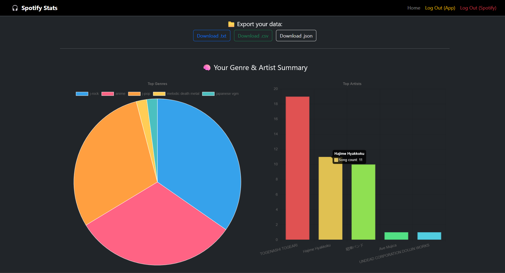

# 🎧 Spotify Info App

A web app that connects to your Spotify account and visualizes your top tracks, profile info, and listening patterns — all in a clean, Bootstrap-styled interface.



---

## 🔗 Live Demo

[spotify-info-app-production.up.railway.app](https://spotify-info-app-production.up.railway.app)

⚠️ Note: Since this app is currently in development mode on Spotify's platform, you’ll need to be added to the allowed testers list to use it.
Please contact me with your Spotify account email, and I’ll add you manually.
---

## 🚀 Features

- ✅ Log in with your Spotify account
- 🎵 View your top 50 tracks
- 📈 Interactive chart using Chart.js
- 📁 Export track data (TXT)
- 🌗 Dark mode interface (Bootstrap-based)
- 🔐 Log out from both app and Spotify

---

## 🧰 Technologies Used

- **Python + Flask** — Backend server & routing
- **Spotipy** — Spotify Web API wrapper
- **Bootstrap 5** — Responsive design
- **Chart.js** — Track visualization
- **Jinja2** — Templating engine

---

## 🔐 Setup (Local Development)

### 1. Clone the repo

```bash
git clone https://github.com/BlitzYp/spotify-info-app.git
cd spotify-info-app
```
### 2. Create a virtual environment & install dependencies

```bash
python -m venv venv
# Activate venv:
# On Windows:
venv\Scripts\activate
# On macOS/Linux:
source venv/bin/activate

pip install -r requirements.txt
```

### 3. Create a .env file

```
SPOTIPY_CLIENT_ID=your_client_id
SPOTIPY_CLIENT_SECRET=your_client_secret
SPOTIPY_REDIRECT_URI=http://127.0.0.1:8888/callback
FLASK_SECRET_KEY=any_secret_key
```
🛠 You can get your credentials from Spotify Developer Dashboard

### 4. Run the app

```bash
python app.py
```

📄 License

MIT License — free to use, fork, and improve.
Feel free to ⭐ the repo if you liked it!
